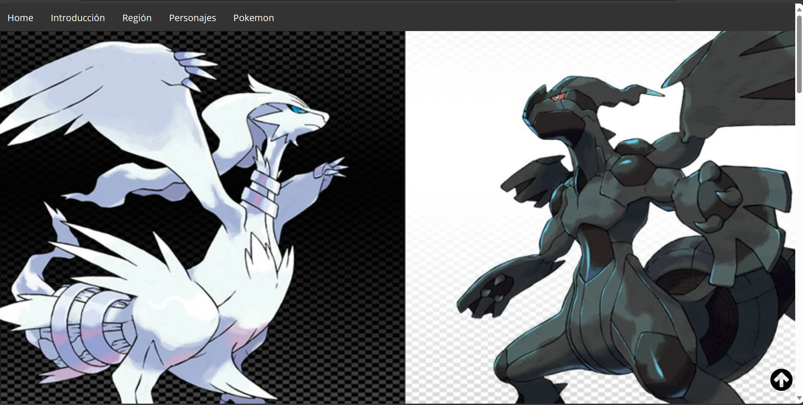
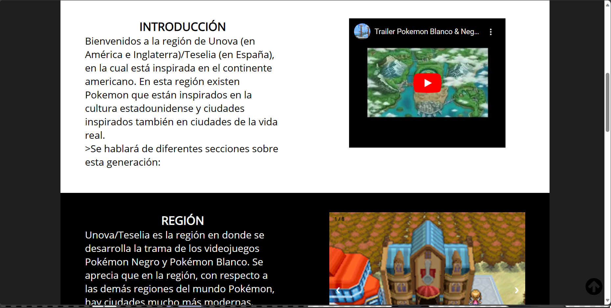
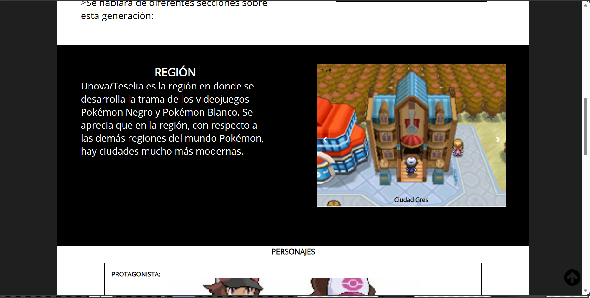
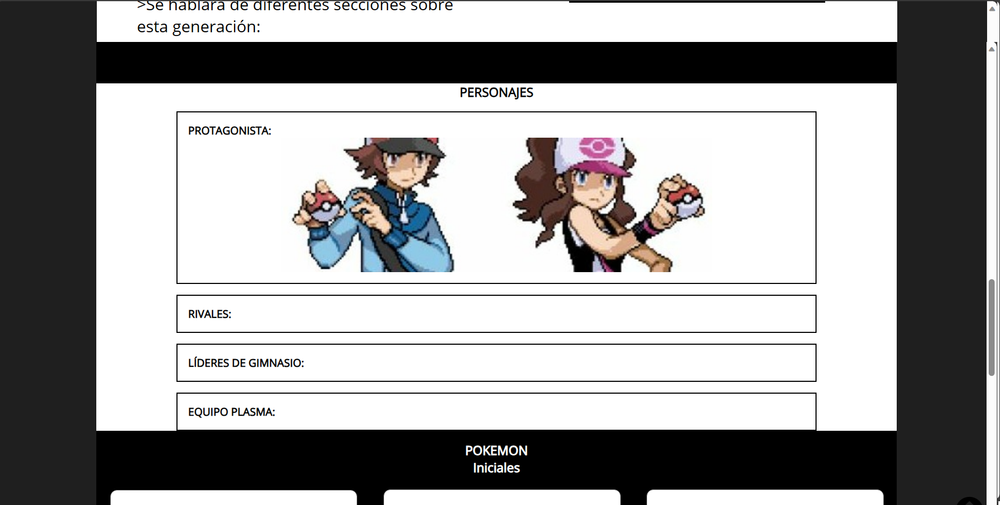
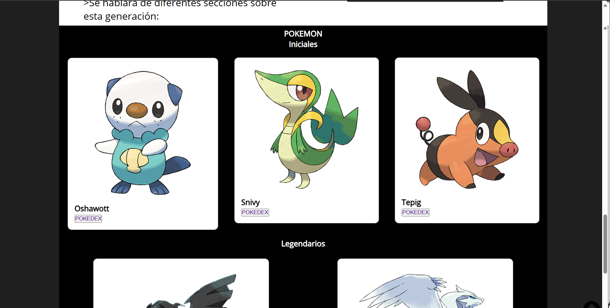
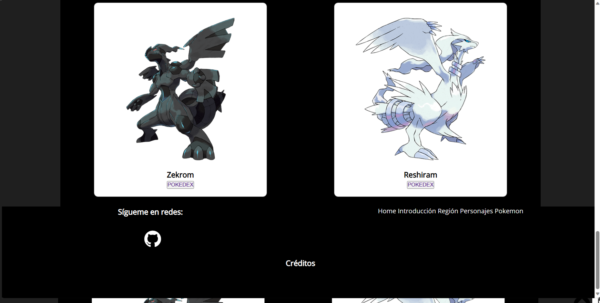

<h1>Memoria del proyecto fin de evaluación de Lenguajes de Marcas - 1º DAW</h1>
<h2>Pokemon Blanco y Negro</h2>

Enlace directo a web navegable:

- <a href="https://danieltf230104.github.io/PokemonBlancoNegro/index.html">Web del proyecto</a>
<h2>Índice</h2>
<ul>
  <li><a href="#introduccion">Introducción</a></li>
  <li><a href="#motivacion">Motivación</a></li>
  <li><a href="#estructura">Estructura</a></li>
  <li><a href="#estilo">Estilo</a></li>
</ul>

<h2 id="introduccion">Introducción</h2>

Trabajo realizado por: Daniel Trujillo Fernández

Proyecto de web desde cero de 1ª evaluación del módulo Lenguajes de Marcas

Diciembre de 2023

Licencia CC-BY

<h2 id="motivacion">Motivación</h2>

Pokemon Blanco y Negro son uno de mis juegos favoritos y me ha entrado mucha ilusión en realizar una página web de uno de mis juegos favoritos.

<h2 id="estructura">Estructura</h2>

La web está dividida en  6 secciones:

<ul>
  <li>Hero Section</li>  
  <li>Introducción</li>
  <li>Región</li>
  <li>Personajes</li>
  <li>Pokemon: iniciales y legendarios</li>
  <li>Footer</li>
</ul>

<h3>Hero Section</h3>

He tomado una imagen de resolucion de pantalla grande y de pantalla más pequeña, como por ejemplo la de móviles

<h3>Introducción</h3>

Texto corto a modo de presentación inicial junto con un vídeo la cual se trata del trailer del juego.

<h3>Región</h3>

Se puede observar la sección de región con una galería de imagenes de ciudades de la misma

<h3>Personajes</h3>

En esta sección se puede ver los diferentes personajes del juego dentro de un acordeón

<h3>Pokemon: iniciales y legendarios</h3>

Hay en esta sección los pokemon iniciales y legendarios metidos dentro de cards.

<h3>Footer</h3>

Footer que cuenta con elementos extilados con grid-2 y un segundo grid-2 al final de la página para los hiperenlaces de la barra de navegación secundaria, copyright y el botón de ventana modal para los recursos.

<h2 id="estilo">Estilo de la página</h2>
<h3>Paleta de colores</h3>

 
  <li>body: rgb(31, 31, 31);</li>
  <li>wrapper {background-color: rgb(0, 0, 0);</li>
  <li>background-color: white;</li>

<h3>Tipografías</h3>

  <li>font-family: POKEMON BLANCO-POKEMON NEGRO ;
  src: url(../font/FontsFree-Net-Proxima-Nova-Bold.otf);</li>
  <li>font-family: textonormal;
  src: url(../font/OpenSans-Regular.ttf);</li>

<h3>Imágenes</h3>

  <li>(<a href="https://www.wikidex.net/wiki/WikiDex">wikidex</a>)</li>
  <li>(<a href="https://www.pokemon.com/es/pokedex">pokedex</a>)</li>

<h2 id="snippets">Code snippets</h2>

He utilizado los siguientes:

<ul>
  <li>Barra de navegación: (<a href="https://www.w3schools.com/">Página de referencia</a>)</li>
  <li>Galería en carrusel tomada de FreeFrontend.com "CSS IMAGE GALLERY - Author: Lubna" (<a href="https://codepen.io/Lubna/pen/MWapdjE">url</a>)</li>
  <li>Card Animation: estructura para la animación tomada del canal de Yotube @midudev (<a href="https://www.w3schools.com/">Página de referencia</a>)</li>
  <li>Ventana Modal para el los créditos en el footer tomada de W3Schools "How TO - CSS/JS Modal" (<a href="https://www.w3schools.com/howto/howto_css_modals.asp">url</a>)</li>
</ul>
